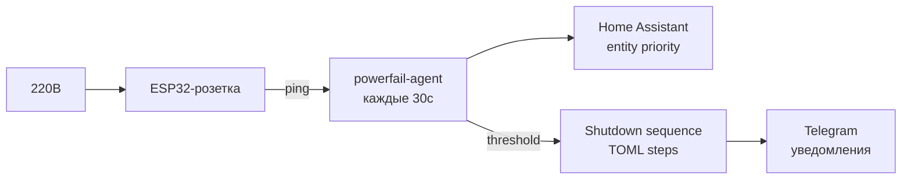

# Powerfail Agent

Go-агент для автоматического выключения Proxmox-хоста при пропадании электричества.

Детекция через **ESP32-розетку** (пинг перед ИБП) и/или **Home Assistant** (сущности с приоритетами).
Гибкая последовательность выключения VM/CT через TOML-конфиг.

## Принцип работы



1. Розетка стоит **перед ИБП** — без 220В перестаёт пинговаться
2. Роутер **в ИБП** — локальная сеть жива при отключении
3. Agent сравнивает показания, считает подозрения
4. Порог достигнут → shutdown sequence по шагам
5. Telegram: предупреждение ДО (интернет есть) и ПОСЛЕ восстановления

## Установка

```bash
bash <(curl -sL https://github.com/akrhin/powerfail-shutdown/releases/latest/download/install.sh)
```

Или вручную:

```bash
# Скачать бинарник
curl -sL https://github.com/akrhin/powerfail-shutdown/releases/latest/download/powerfail-agent-linux-amd64 \
  -o /usr/local/bin/powerfail-agent
chmod +x /usr/local/bin/powerfail-agent

# Создать конфиг
mkdir -p /etc/powerfail
cp powerfail.toml.example /etc/powerfail/powerfail.conf
# Заполни свои параметры
```

## Конфигурация

Полный пример: [`powerfail.toml.example`](./powerfail.toml.example)

### Режимы детекции

| mode | Описание |
|------|----------|
| `ping` | Только ping (main=подозрение, secondary=подтверждение) |
| `ha`   | Только HA (priority=1 подозрение, 2+=подтверждение) |
| `any`  | Любой источник = подозрение, два любых = immediate shutdown |
| `all`  | Все источники должны согласиться (ping + HA) |

### Порядок выключения

```toml
[[shutdown.step]]
type = "ct"          # pct shutdown
vmid = 107

[[shutdown.step]]
type = "wait"        # пауза
timeout = 10

[[shutdown.step]]
type = "vm"          # qm shutdown + ожидание
vmid = 100
timeout = 300

[[shutdown.step]]
type = "all_vm"      # force-stop остальных VM

[[shutdown.step]]
type = "all_ct"      # force-stop остальных CT
```

Если последовательность не задана — `all_vm` → `all_ct` (дефолт).

## Команды

| Команда | Описание |
|---------|----------|
| `powerfail-agent run` | Один цикл проверки (для systemd timer) |
| `powerfail-agent test-network` | Проверить ping/HA/VM |
| `powerfail-agent test-telegram` | Отправить тестовое сообщение |
| `powerfail-agent dry-run` | Симуляция без выключения |

## Сборка из исходников

```bash
make build          # linux/amd64
make build-all      # linux/amd64 + linux/arm64
make test           # тесты
```

## CI/CD

На каждый push:
- `golangci-lint` — статический анализ
- `go test -race -cover` — тесты с гонками
- `gosec` — проверка безопасности
- На тег `v*` — `goreleaser` собирает и публикует релиз

## Xpenology (страховочный скрипт)

На случай, если Proxmox не успел выключить Xpenology.  
Ставится на сам Xpenology через Task Scheduler:

```bash
# Скачать скрипт
curl -sL https://raw.githubusercontent.com/akrhin/powerfail-shutdown/main/deploy/powerfail-xpenology.sh \
  -o /root/powerfail-xpenology.sh
chmod +x /root/powerfail-xpenology.sh

# Добавить в Task Scheduler: run every 1 minute
# Task: /root/powerfail-xpenology.sh
```
