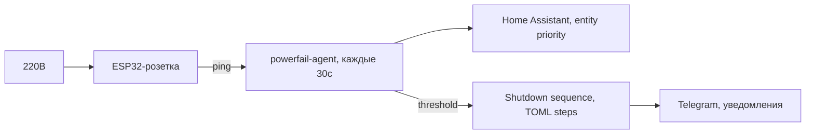

# Powerfail Agent

Go-агент для автоматического выключения Proxmox-хоста при пропадании электричества.

Детекция через **ESP32-розетку** (пинг перед ИБП) и/или **Home Assistant** (сущности с приоритетами).
Гибкая последовательность выключения VM/CT через TOML-конфиг.

## Принцип работы



1. Розетка стоит **перед ИБП** — без 220В перестаёт пинговаться
2. Роутер **в ИБП** — локальная сеть жива при отключении
3. Agent сравнивает показания, считает подозрения
4. Порог достигнут → shutdown sequence по шагам
5. Telegram: предупреждение ДО (интернет есть) и ПОСЛЕ восстановления

## Как это работает как сервис

Проект ставится как **systemd timer**, дёргающий `powerfail-agent run` каждые 30 секунд:

```bash
# Таймер запускает сервис:
powerfail-agent.timer ──→ powerfail-agent.service ──→ /usr/local/bin/powerfail-agent run
```


## Установка

```bash
bash <(curl -sL https://github.com/akrhin/powerfail-shutdown/releases/latest/download/install.sh)
```

Или вручную:

```bash
# Скачать бинарник
curl -sL https://github.com/akrhin/powerfail-shutdown/releases/latest/download/powerfail-agent-linux-amd64 \
  -o /usr/local/bin/powerfail-agent
chmod +x /usr/local/bin/powerfail-agent

# Создать конфиг
mkdir -p /etc/powerfail
cp powerfail.toml.example /etc/powerfail/powerfail.conf
# Заполни свои параметры
```

## Конфигурация

Полный пример: [`powerfail.toml.example`](./powerfail.toml.example)

### Режимы детекции

| mode | Описание |
|------|----------|
| `ping` | Только ping (main=подозрение, secondary=подтверждение) |
| `ha`   | Только HA (priority=1 подозрение, 2+=подтверждение) |
| `any`  | Любой источник = подозрение, два любых = immediate shutdown |
| `all`  | Все источники должны согласиться (ping + HA) |

### Порядок выключения

```toml
[[shutdown.step]]
type = "ct"          # pct shutdown
vmid = 107

[[shutdown.step]]
type = "wait"        # пауза
timeout = 10

[[shutdown.step]]
type = "vm"          # qm shutdown + ожидание
vmid = 100
timeout = 300

[[shutdown.step]]
type = "all_vm"      # force-stop остальных VM

[[shutdown.step]]
type = "all_ct"      # force-stop остальных CT
```

Если последовательность не задана — `all_vm` → `all_ct` (дефолт).

## Команды

| Команда | Описание |
|---------|----------|
| `powerfail-agent run` | Один цикл проверки (для systemd timer) |
| `powerfail-agent test-network` | Проверить ping/HA/VM |
| `powerfail-agent test-telegram` | Отправить тестовое сообщение |
| `powerfail-agent dry-run` | Симуляция без выключения |
| `powerfail-agent maintenance N` | Отключить проверки на N минут (0 = выкл) |
| `powerfail-agent maintenance` | Показать статус maintenance |
| `powerfail-agent install` | Установить systemd-сервис + таймер |

## Maintenance mode

Для отключения детекции на время работ:

```bash
powerfail-agent maintenance 60    # отключить на 60 мин
powerfail-agent maintenance       # проверить статус
powerfail-agent maintenance 0     # отключить maintenance
```

Создаёт флаг `/tmp/.powerfail_maintenance` со временем окончания. При старте агент сбрасывает счётчик и выходит без проверок.

## Сборка из исходников

```bash
make build          # linux/amd64
make build-all      # linux/amd64 + linux/arm64
make test           # тесты
```

## CI/CD

На каждый push:
- `golangci-lint` — статический анализ (errcheck, gosec, staticcheck, govet)
- `govulncheck` — проверка уязвимостей Go-зависимостей
- `gitleaks` — поиск секретов в коде
- `go test -race -cover` — тесты
- На тег `v*` — сборка и публикация релиза (amd64 + arm64, бинарники + install.sh)

## Безопасность

- Все секреты (`bot_token`, `ha.token`) хранятся только в `/etc/powerfail/powerfail.conf` (chmod 600)
- `git-filter-repo` используется для scrub'а чувствительных данных из истории git
- CI: gitleaks проверяет каждый push на утечки
- History scrub: `2026-07-19` — удалены реальные IP, HA token, chat_id из 50 коммитов

## Лицензия и отказ от ответственности

MIT License

Copyright (c) 2026 akrhin

Данное программное обеспечение разработано с использованием генеративных языковых моделей (ИИ).
Автор не несёт ответственности за любые последствия, прямые или косвенные, связанные с использованием данного программного обеспечения, включая, но не ограничиваясь: потерей данных, нарушением работы оборудования, финансовыми потерями или иными убытками.

Программное обеспечение предоставляется «как есть», без каких-либо гарантий, явных или подразумеваемых.

Полный текст: [`LICENSE`](LICENSE)
